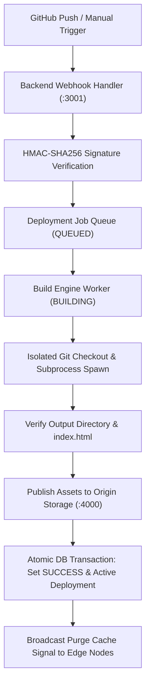
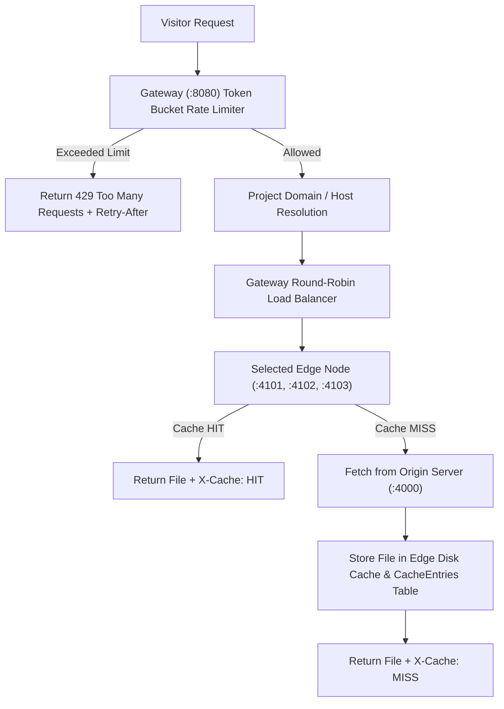

# EdgeDeploy Architecture Specification

EdgeDeploy is split into two distinct, decoupled request execution pipelines:

---

## 1. Pipeline 1: Deployment Pipeline (CI/CD Half)

### Critical Invariants:
1. **Atomic Deployment Switch:** `Projects.active_deployment_id` is updated only inside a single SQL transaction upon 100% successful build execution and static asset verification.
2. **Failure Isolation:** In-progress or `FAILED` builds **never** overwrite `active_deployment_id`. Existing live sites continue serving visitors with zero downtime.

---

## 2. Pipeline 2: Serving Pipeline (CDN Half)

---

## 3. Algorithm Selection & Trade-Offs

### Rate Limiting: Token Bucket vs. Fixed / Sliding Window
- **Fixed Window:** Simple counter per time window (e.g. 60s). *Drawback:* Allows double the rate limit at window boundary edges.
- **Sliding Window Log:** Precise timestamp logging. *Drawback:* High memory overhead O(N) per client IP.
- **Token Bucket (Selected):** Allows smooth average rate refill (`config.rateLimit.refillPerSec`) with configured burst capacity (`config.rateLimit.capacity`). Evaluated O(1) in memory, with async SQL persistence off the hot path.

### Load Balancing: Round-Robin with Active Health Checking
- Rotates incoming visitor requests across active `HEALTHY` edge processes.
- Active health checker probes `GET /health` on edges every 5s (`HEALTH_INTERVAL_MS`).
- Unresponsive nodes marked `UNHEALTHY`/`OFFLINE` and automatically removed from rotation. Upon recovery, nodes rejoin rotation seamlessly.

### Cache Eviction: LRU (Least Recently Used)
- When edge disk cache exceeds `CACHE_MAX_ENTRIES` (default 100), the entry with the oldest `last_accessed_at` timestamp is evicted from both memory and disk storage.
