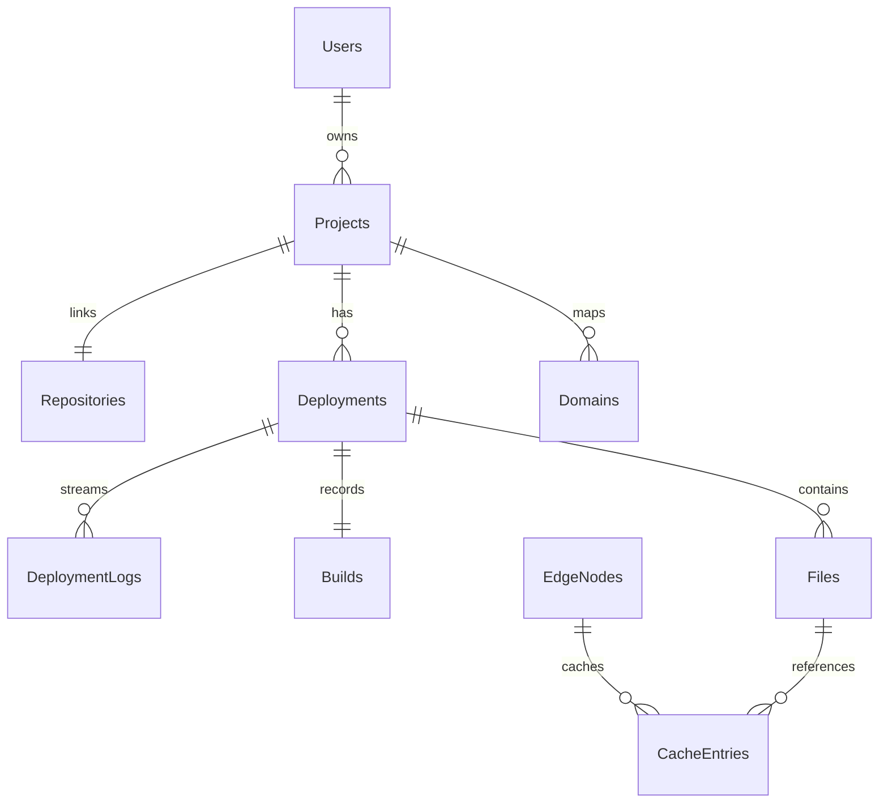

# EdgeDeploy Database ERD & Schema Reference

EdgeDeploy uses **MySQL 8 / MariaDB 10.4** with **raw SQL parameterized queries (`mysql2/promise`)** without ORM abstractions.

---

## Relational Schema ERD

---

## 12 SRS Tables Summary

1. **`Users`**: System authentication, BCrypt hashes, roles (`DEVELOPER`, `ADMIN`), block status.
2. **`Projects`**: User static sites, build/install commands, active deployment reference.
3. **`Repositories`**: GitHub repository URLs, HMAC signature secrets (`webhook_secret`).
4. **`Deployments`**: Deployment history, commit SHAs, status state machine (`QUEUED`, `BUILDING`, `SUCCESS`, `FAILED`).
5. **`DeploymentLogs`**: Streamed stdout/stderr terminal build logs line-by-line.
6. **`Builds`**: Durations, command arguments, exit codes, and error summaries.
7. **`Files`**: Published static asset paths, sizes, mime content-types, and SHA-256 hashes (ETag source).
8. **`EdgeNodes`**: Configured edge processes (:4101-:4103), regions, health statuses, heartbeats.
9. **`CacheEntries`**: Edge node disk cache index, TTL expirations, hit counts, LRU access timestamps.
10. **`RequestLogs`**: CDN request telemetry, latency, status codes, cache HIT/MISS indicators.
11. **`RateLimits`**: Token bucket state per client IP, window counts, admin block flags.
12. **`Domains`**: Hostname mappings (`<slug>.localhost`).
