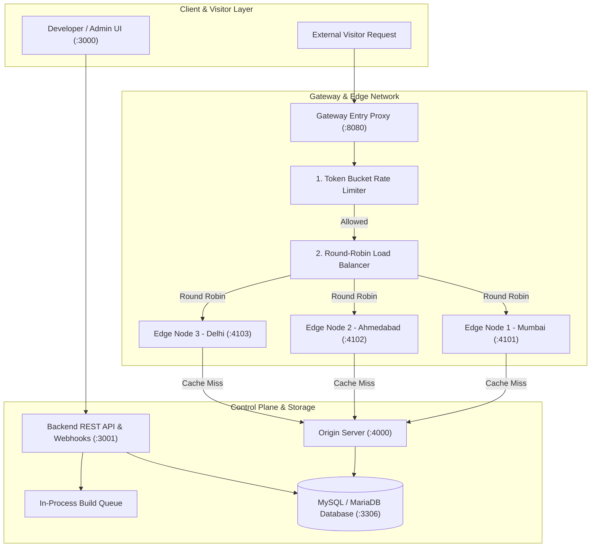
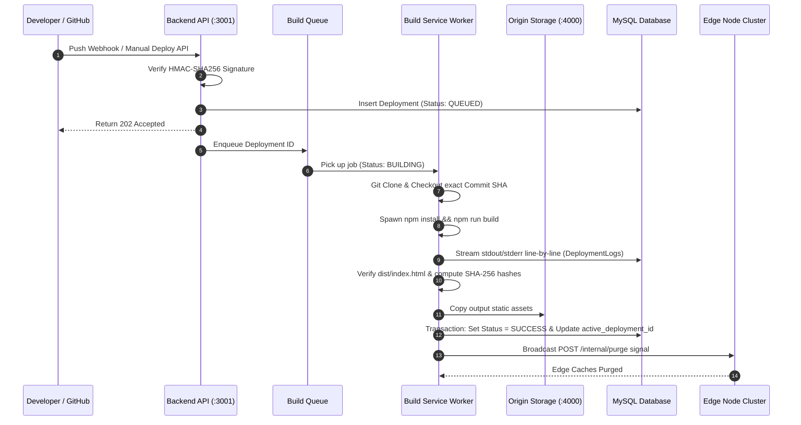
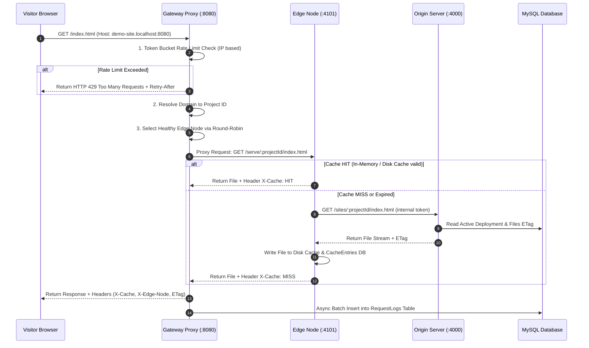

# EdgeDeploy Architecture Explainer & Study Guide

Welcome to the **EdgeDeploy Architecture Guide**! This document explains how EdgeDeploy works under the hood in plain, intuitive language, complete with sequence flows, module breakdowns, algorithm choices, and viva Q&A points.

---

## 💡 What is EdgeDeploy?

**EdgeDeploy** is an academic distributed edge hosting platform modeled after platforms like **Vercel / Netlify** combined with **Cloudflare CDN**.

It separates the system into **two distinct operational halves**:
1. **Deployment Pipeline (CI/CD Half):** Takes code from GitHub, builds it in an isolated directory, publishes static assets to the Origin server, and purges edge caches.
2. **Serving Pipeline (CDN Half):** Intercepts visitor traffic at the Gateway, enforces Token Bucket rate limits, load-balances requests across simulated Edge nodes using Round-Robin, serves cached files instantly on a **HIT**, or fetches from Origin on a **MISS**.

---

## 🏛️ System Architecture Overview

---

## 🔄 Deep-Dive: The Two Execution Pipelines

### Pipeline 1: Deployment Pipeline (CI/CD)

When a developer pushes code to GitHub or clicks **"Trigger Deploy"** in the dashboard:

#### 🛡️ Critical Deployment Invariants:
- **Atomic Cutover:** The live site is switched to the new deployment only inside a single SQL transaction after the build process finishes and output files are verified.
- **Zero-Downtime Failure Preservation:** If a build fails (missing `index.html`, syntax error, build timeout), `active_deployment_id` is **never updated**. Visitors continue receiving the previous working version with zero interruption.

---

### Pipeline 2: Serving Pipeline (CDN Traffic)

When a visitor navigates to `http://demo-site.localhost:8080/index.html`:

---

## ⚙️ Core Algorithms & Architectural Choices

### 1. Token Bucket Rate Limiting (Gateway)
- **Why Token Bucket?** Fixed window counters permit rate limit spikes at boundary transitions. Sliding window logs require high memory O(N) per IP. Token Bucket allows smooth average consumption with burst capacity (`RATE_LIMIT_CAPACITY=10`, `RATE_LIMIT_REFILL_PER_SEC=2`).
- **Hot-Path Optimization:** Bucket state is evaluated in-memory at O(1) speed. Rate limit metrics and offender logs are flushed asynchronously to the `RateLimits` database table without blocking HTTP requests.

### 2. Round-Robin Load Balancing & Failover
- Rotates requests across healthy edge nodes (`edge-1`, `edge-2`, `edge-3`).
- **Active Health Probing:** The Gateway sends health checks (`GET /health`) every 5 seconds. If a node fails 2 consecutive probes, it is marked `UNHEALTHY` and removed from rotation. When it recovers, it rejoins traffic rotation automatically.
- **Mid-Request Retry:** If an edge node fails mid-request, the Gateway transparently retries the request once on another healthy edge node before returning an error.

### 3. LRU Cache Eviction (Edge Nodes)
- Each Edge Node maintains a configurable cache capacity (`CACHE_MAX_ENTRIES=100`).
- When capacity is reached, the entry with the oldest `last_accessed_at` timestamp is evicted from disk storage and the `CacheEntries` database table.

---

## 🗄️ Relational Database Schema (12 Tables)

| Table Name | Purpose | Key Columns |
|---|---|---|
| `Users` | User authentication & RBAC | `email`, `password_hash`, `role` (DEVELOPER/ADMIN), `is_blocked` |
| `Projects` | Deployed applications | `name`, `slug`, `build_command`, `output_directory`, `active_deployment_id` |
| `Repositories` | Linked GitHub repository | `repo_url`, `owner`, `name`, `webhook_secret` |
| `Deployments` | Deployment history | `commit_sha`, `status` (QUEUED/BUILDING/SUCCESS/FAILED), `trigger` |
| `DeploymentLogs` | Streamed build terminal output | `deployment_id`, `seq`, `stream` (STDOUT/STDERR/SYSTEM), `message` |
| `Builds` | Performance telemetry | `install_duration_ms`, `build_duration_ms`, `exit_code`, `error_summary` |
| `Files` | Static output asset metadata | `path`, `size_bytes`, `content_type`, `sha256` (ETag source) |
| `EdgeNodes` | Simulated edge process state | `name`, `port`, `region`, `status` (HEALTHY/UNHEALTHY/OFFLINE) |
| `CacheEntries` | CDN edge cache index | `edge_node_id`, `cache_key`, `ttl_seconds`, `expires_at`, `hit_count` |
| `RequestLogs` | Telemetry & analytics | `client_ip`, `path`, `latency_ms`, `cache_result` (HIT/MISS/NONE) |
| `RateLimits` | Firewall & Token Bucket state | `client_ip`, `tokens`, `request_count`, `is_blocked`, `block_reason` |
| `Domains` | Hostname routing | `hostname` (`<slug>.localhost`), `is_primary` |

---

## 🎓 Academic Viva Defense Q&A

### Q1: Why is Rate Limiting executed BEFORE Load Balancing?
> **Answer:** Enforcing rate limits at the Gateway entry point protects downstream edge processes and the Origin server from being overloaded by unauthorized or abusive traffic.

### Q2: How does EdgeDeploy guarantee zero downtime during a failed build?
> **Answer:** Build output is compiled in an isolated temporary directory (`storage/builds/deployment-<id>`). Only when the build succeeds and `dist/index.html` is verified do we publish files to Origin and update `Projects.active_deployment_id` in an atomic database transaction. If the build fails, `active_deployment_id` is untouched, so existing traffic continues serving from the previous successful deployment.

### Q3: Why use raw SQL queries with `mysql2` instead of an ORM like Prisma or TypeORM?
> **Answer:** Using raw parameterized SQL statements ensures full control over query optimization, explicit transaction boundaries, clear relational foreign keys, zero ORM overhead, and high academic clarity for code inspection.

### Q4: How does Edge Cache Invalidation work upon a new deployment?
> **Answer:** When a build succeeds, the Build Service sends an authenticated internal HTTP request (`POST /internal/purge`) to all active Edge Node processes. The edge nodes clear their in-memory index, delete matching files from disk, and remove corresponding rows from `CacheEntries`. Subsequent visitor requests result in a **MISS**, fetching the updated content from Origin.
